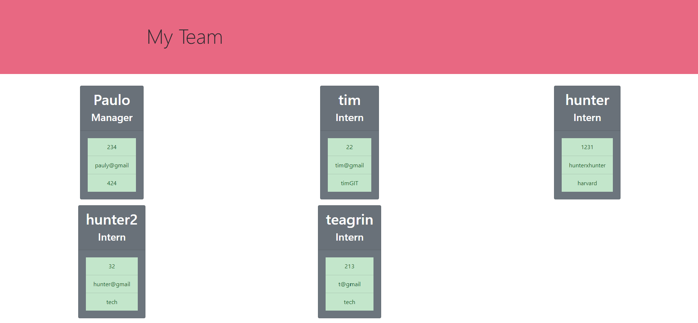

# TeamProfileGenerator--PauloCondori
I wil create a profile Generator using JS and Node.js

## Description
- We will generate an html file to display through using only Node. Node will run prompts to ask question like name, email, ID, etc. 
Manager info will first be asked and then it will ask you if you want to enter information engineer or interns. Only after you enter 'Quit'
will it end and generate the actual html. 

### What was your motivation?
I needed to know more Node.js to further improve 

### Why did you build this project? (Note: the answer is not "Because it was a homework assignment.")
Node js is the foundation for the next things we will learn. I also wanted to put more Oject Oriented Programming 
into this hw assignment.

### What problem does it solve?
Creating a team sheet for a manager in seconds

### What did you learn?
How to enter send whole functions in other functions. Using and creating documents with Node.js

## Table of Contents 

-[Installation](#installation)
-[Usage/Instructions](#Usage/Instructions)
-[Contributing](#Contributing)
-[Test](#Test)
-[Questions](#Questions)

## Installation
Run node index.js and answer all the question 

## Usage/Instructions

## Example

## Contributing
- Paulo Sergio Condori Pinedo

##Tests 
Tested all files in the libs folder in the Integrated Terminal. Ran 'mpn run test'

#Questions 
If you have any questions about the repo, open an issue or contact me directly at paulocondori1@gmail.com. You can find more of my work at pcondori1996)

🏆 🏆 🏆 🏆 🏆 🏆 🏆 🏆 🏆 🏆 🏆 🏆 🏆 🏆 🏆 🏆 🏆 🏆 🏆 🏆`
};